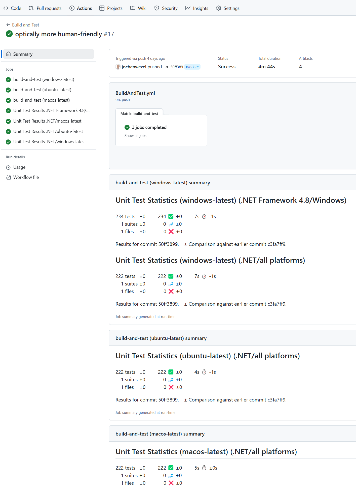
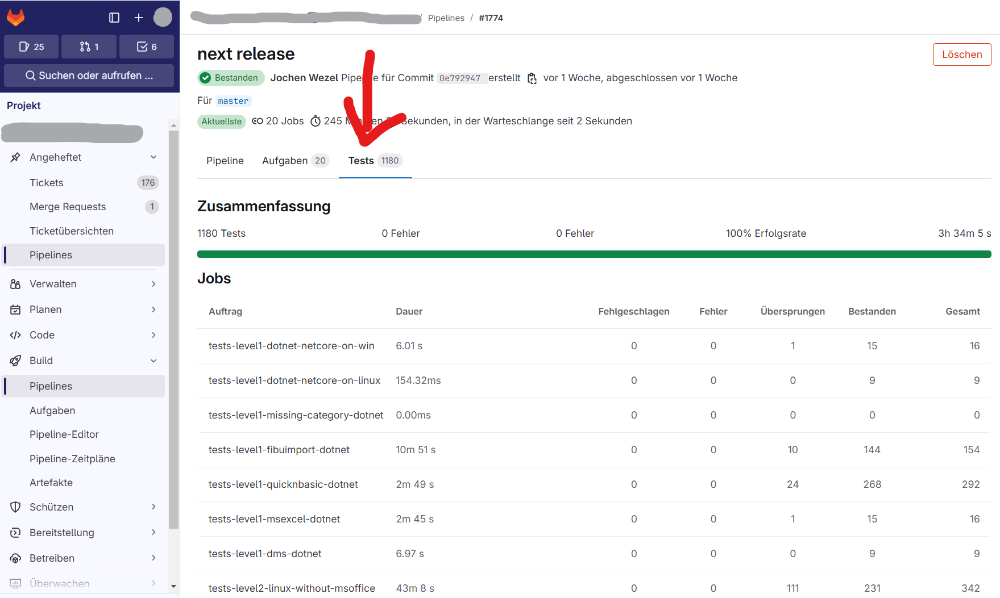

# JUnitTestLogger4GitHub

This is a .NET library that adapts unit test output into the JUnit result format - with error message and stack trace combined into a single value for compatibility with GitHub/GitLab test pipelines

## Purpose of this fork

* The origin JUnitTestLogger creates nice JUnit xml data as required by the specification
* BUT: GitHub respectively the publishing component for unit test results EnricoMi/publish-unit-test-result-action@v1 display either the error message or the stacktrace, but not both
* THAT'S WHY there is the need for a component combining error message and stack trace into a single field

## Usage

### Step 1: Add NuGet package to your dotnet unit test project

Please note: test project usually requires the nuget package `JUnitTestLogger` to be able to provide JUnit compatible test results XML file (required 
for pushing back details on succeeded/failed tests)

NuGet install command: `Install-Package JUnitTestLogger`

### Step 2: run unit tests for each platform separately

PLEASE NOTE: a simple `dotnet test --results-directory test-results --logger junit` might run tests for multiple target frameworks (e.g. net8.0,net48). In effect, the TestResults.xml file would be overwritten by the other framework test results. That's why you should run the unit tests separately for each target Framework.

### GitHub

In your YAML file at .github/workflows/BuildAndTest.yml, define jobs like in following example. Please note the multi-platform/multi-target approach of the example.



```yml
    build-and-test:
        runs-on: ${{ matrix.os }}

        strategy:
          fail-fast: false
          matrix:
            #arch: [x86, x86_64, arm]
            os: [windows-latest, ubuntu-latest, macos-latest]
            include: 
              - os: macos-latest
                runNetExe: mono

        steps:
            - name: Checkout
              uses: actions/checkout@v4

            - name: Setup .NET Core
              uses: actions/setup-dotnet@v4
              with:
                 dotnet-version: 8.0.x

            - name: Install dependencies
              run: dotnet restore

            - name: Build
              run: dotnet build --no-restore 

            - name: Run Unit Tests
              run: dotnet test --framework net8.0 --results-directory test-results-net8.0 --logger junit --no-restore 

            - name: Run Unit Tests
              run: dotnet test --framework net48 --results-directory test-results-net48 --logger junit --no-restore 

            - name: Unit Test Results (Linux) - NET 8.0
              uses: EnricoMi/publish-unit-test-result-action@v2
              if: always() && startsWith(matrix.os, 'ubuntu')
              with:
                github_token: ${{ secrets.GITHUB_TOKEN }}
                files: "test-results-net8.0/TestResults.xml"
                check_run_annotations: all tests
                comment_title: Unit Test Statistics (${{matrix.os}}-net8.0)
                check_name: Unit Test Results (${{matrix.os}}-net8.0)
                report_individual_runs: true
      
            - name: Unit Test Results (Win/Mac) - NET 8.0
              uses: EnricoMi/publish-unit-test-result-action/composite@v2
              if: always() && (!(startsWith(matrix.os, 'ubuntu'))) 
              with:
                github_token: ${{ secrets.GITHUB_TOKEN }}
                files: "test-results-net8.0/TestResults.xml"
                check_run_annotations: all tests
                comment_title: Unit Test Statistics (${{matrix.os}}-net8.0)
                check_name: Unit Test Results (${{matrix.os}}-net8.0)
                report_individual_runs: true
      
            - name: Unit Test Results (Linux) - NET Framework 4.8
              uses: EnricoMi/publish-unit-test-result-action@v2
              if: always() && startsWith(matrix.os, 'ubuntu')
              with:
                github_token: ${{ secrets.GITHUB_TOKEN }}
                files: "test-results-net48/TestResults.xml"
                check_run_annotations: all tests
                comment_title: Unit Test Statistics (${{matrix.os}}-net48)
                check_name: Unit Test Results (${{matrix.os}}-net48) 
                report_individual_runs: true
      
            - name: Unit Test Results (Win/Mac) - NET Framework 4.8
              uses: EnricoMi/publish-unit-test-result-action/composite@v2
              if: always() && (!(startsWith(matrix.os, 'ubuntu'))) 
              with:
                github_token: ${{ secrets.GITHUB_TOKEN }}
                files: "test-results-net48/TestResults.xml"
                check_run_annotations: all tests
                comment_title: Unit Test Statistics (${{matrix.os}}-net48)
                check_name: Unit Test Results (${{matrix.os}}-net48)
                report_individual_runs: true
      
            - name: Publish Unit Test Results - NET 8.0
              uses: actions/upload-artifact@v4
              if: always()
              with:
                name: NUnit Test Results ${{ matrix.os }}
                path: test-results-net8.0/TestResults.xml

            - name: Publish Unit Test Results - NET Framework 4.8
              uses: actions/upload-artifact@v4
              if: always()
              with:
                name: NUnit Test Results ${{ matrix.os }}
                path: test-results-net48/TestResults.xml

```

### GitLab



In your YAML file, define a test job like

```yml
test_job:
  stage: test
  needs:
    - build
  script:
    - 'dotnet test --no-restore --logger "junit;LogFilePath=TestResult.JUnit.xml"'
  artifacts:
    when: always  # save test results even when the task fails
    expire_in: 1 month  
    paths:
      - './TestResult.JUnit.xml'  # saving NUnit results as Jenkins JUnit XML
    reports:
      junit:
        - './TestResult.JUnit.xml'  # saving NUnit results as Jenkins JUnit XML
```

## NuGet package availability

https://www.nuget.org/packages/JUnitTestLogger4GitHub/

## License and Authors

[](https://github.com/CompuMasterGmbH/JUnitTestLogger/blob/master/LICENSE)
[](https://github.com/CompuMasterGmbH/JUnitTestLogger/graphs/contributors)

This software is made available by GMV Syncromatics Engineering and CompuMaster GmbH under the MIT license.
